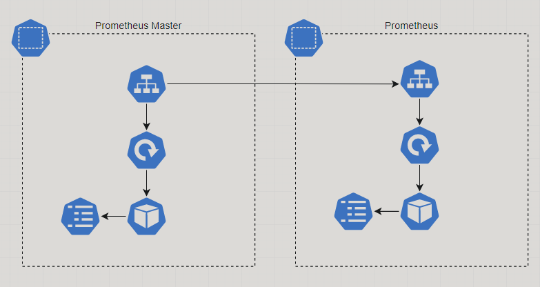
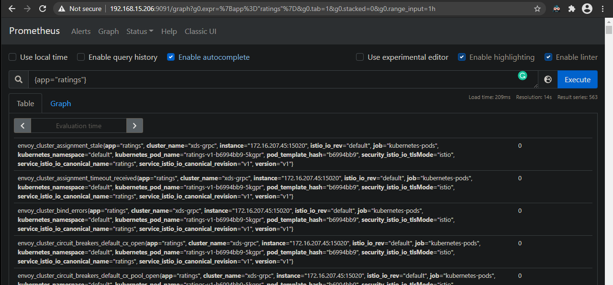
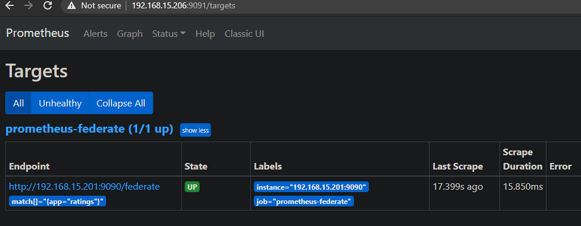

# Como coletar as métricas já coletadas por outro prometheus?



## Índice

- [Sobre](#sobre)
- [Pré reqs](#pre-reqs)
- [install](#install)

## Sobre <a name = "sobre"></a>

Artigo de referência (https://docs.d2iq.com/mesosphere/dcos/services/prometheus/0.1.0-2.3.2/configuration/prometheus-federation/)

Base para configurar uma instância de Prometheus que irá coletar métricas de outras instâncias prometheus :), imagina que você já tem um prometheus que coleta as métricas das suas apps e você quer mandar essas métricas para uma outra instância de Prometheus em outro lugar. Para isso o Prometheus tem o que eles chamam de federation (https://prometheus.io/docs/prometheus/latest/federation/).

## Pré reqs <a name = "pre-reqs"></a>

Para fazer essa demo, os pré requisitos são:

- Cluster Kubernetes
- Uma instância de Prometheus já rodando e coletando métricas.
- Um LoadBalancer, se não tiver, você pode usar um ingress-controller ou colocar o nome completo do service (my-svc.my-namespace.svc.cluster.local) no campo "targets" da config de scraping do prometheus master.

## Instalação <a name = "install"></a>

Altere as configurações de scraping no arquivo [prom-master/cm-prom-master.yaml](prom-master/cm-prom-master.yaml)

Veja que nesse arquivo nós estamos coletando somente as métricas dos objetos que estão com a label app="ratings":
```yaml
    params:
    'match[]':
        - '{app="ratings"}'

    static_configs:
    - targets:
    - 192.168.15.201:9090  # <- Esse é o prometheus "worker"
```

```bash
kubectl apply -f prom-master/ns-prom-master.yaml
kubectl apply -f prom-master/
```





